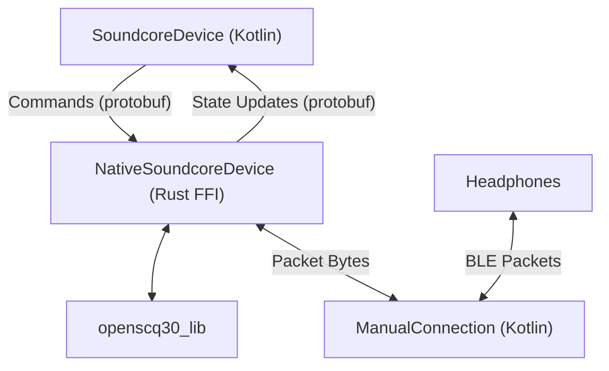

TODO add details

### Lib

openscq30_lib handles the device communication and state management. On desktop, lib implements the bluetooth functionality. For other platforms (web/android), an implementation must be supplied.

### CLI

Straight forward, uses openscq30_lib in an uncomplicated manner.

### GUI

TODO

### Android

TODO

### Web

TODO
